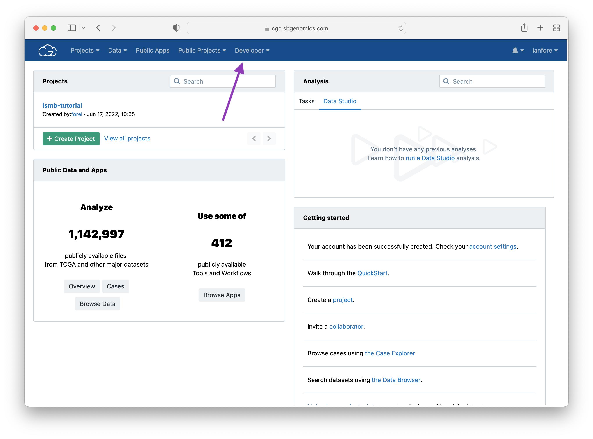
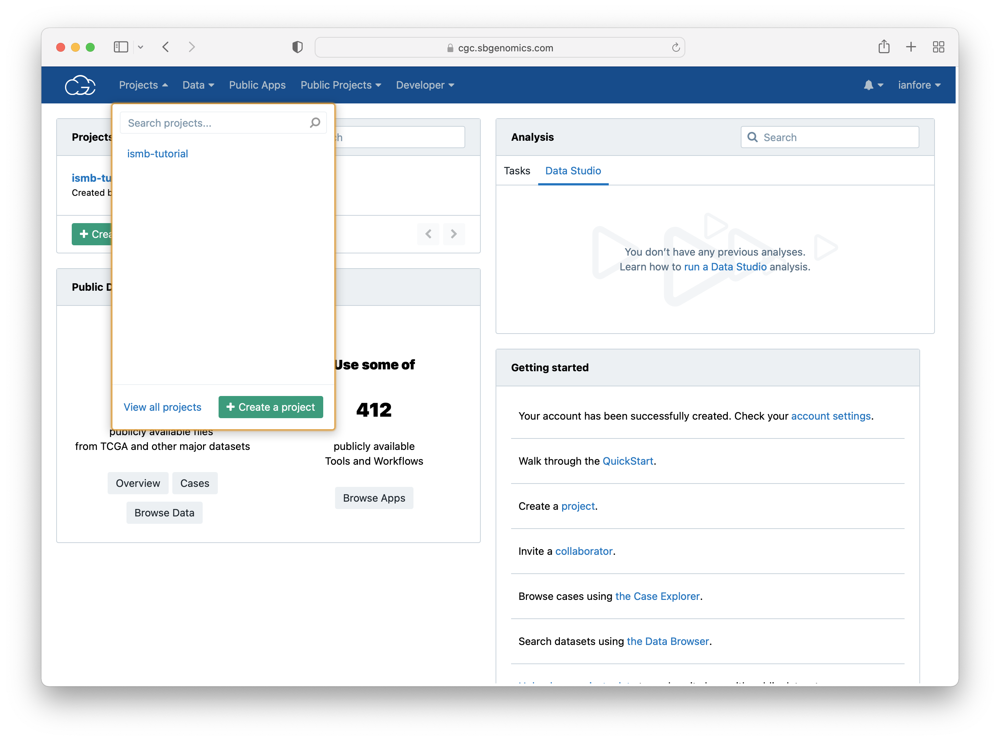

# Session 2: Federated Analysis - Find and access data in the cloud via Data Connect and Data Repository Service (DRS)

## Outline

**Time:** Sunday, July 10th, 2022 @ 12 pm - 1 pm

**Slides:** [link](https://docs.google.com/presentation/d/1zuw_KVO_TQy91ODBWYmObkc_FTkAK7iy-SETjTY5TkQ)

Participants will use python clients for GA4GH services and write scripts in Jupyter notebooks.

Participants will interact with Driver Project implementations of Data Connect and DRS to locate and access files in datasets such as TCGA, GTEx, and TopMed and run workflows against them using WES (though that could be the add in the following session).

## Tutorial


## Session specific requirements

#### Fasp-scripts

Clone the fasp-client branch of fasp-scripts

`git clone -b fasp-client --single-branch https://github.com/ga4gh/fasp-scripts.git`

If you are using Python virtual environments and set one up for the tutorial activate that environment now.

change directory to local copy of fasp-scripts

`pip install .`

#### Cloud credits

Starter accounts with cloud credits on selected platforms (to be listed e.g. Seven Bridges Cancer Genomics Cloud)

#### Create a project in the Cancer Genomics Cloud

Open http://cgc.sbgenomics.com and login with your username and password.



From the Projects menu select **Create a Project**



Fill in project details


#### Obtain an authentication token and save it to disk

Go to the Developer Menu and copy the authentication token to the clipboard 


Open the file 

ismb-2022-ga4gh-tutorial/sessions/session2/keys/sbcgc_key.json 

Replace your_token_here with the token copied from the page above.

```json
{"auth_token" : "your_token_here"}
```

Create a folder in your home directory called .keys

Copy the sbcgc_key.json file there.

Note: you may save the file elsewhere. If so, make a note of the location you saved it to as you will need to replace the default path later.

#### Start Jupyter

```
cd ../sessions
jupyter notebook
```


Click on session1 to open the folder

Click on 1-1 Access token check.ipynb

Follow the instructions in the notebook

Check for a successful response

Close the browser tab or window to return to the notebook

Click on the .. folder icon to navigate back up to the sessions folder.


